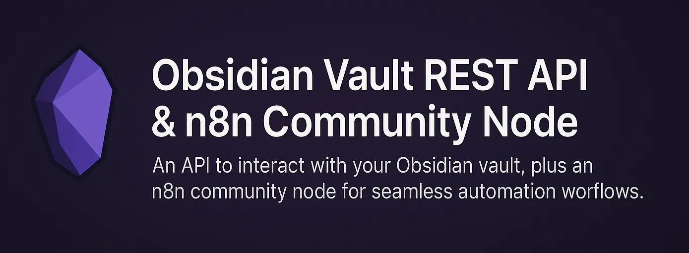

# Obsidian Vault REST API

> **🤖 AI-Agent Optimized** - Designed specifically for AI agents and automation tools like n8n, with intelligent endpoints that eliminate complex workflows.



A powerful Laravel-based REST API for your local Obsidian vault that provides both traditional CRUD operations and **AI-native endpoints** designed to reduce cognitive load for AI agents.

## ✨ Key Features

### 🧠 AI-Native Design
- **One-Step Operations**: Upsert notes without existence checks
- **Intelligent Search**: Multi-scope search with relevance scoring  
- **Smart Discovery**: Find daily notes regardless of naming convention
- **Pagination Built-In**: Prevents context overflow for AI agents
- **Human-Like Queries**: Natural language-style endpoints

### 🔧 Traditional Features  
- Full CRUD operations for files and notes
- Frontmatter support with YAML parsing
- Bulk operations for efficiency
- OpenAPI specification for easy integration

## 🚀 Quick Examples

```bash
# AI-Native: Create or update note (no existence check needed)
POST /api/notes/upsert
{"path": "daily-log", "content": "Today's tasks", "front_matter": {"tags": ["work"]}}

# AI-Native: Smart search across content, filenames, and tags  
GET /api/vault/search?query=project&scope[]=content&scope[]=tags

# AI-Native: Find today's daily note automatically
GET /api/vault/notes/daily?date=today

# AI-Native: Append to file without reading first
POST /api/files/write
{"path": "log.md", "content": "New entry\n", "mode": "append"}
```

## 📖 Documentation

- **[AI-Native API Guide](AI_NATIVE_API.md)** - Complete guide to AI-optimized endpoints
- **[OpenAPI Specification](openapi.yaml)** - Traditional REST API documentation

## Prerequisites

If you plan to integrate this API in an n8n workflow, install the community node [n8n-nodes-obsidian-vault-rest-api](https://github.com/j-shelfwood/n8n-nodes-obsidian-vault-rest-api) in your n8n instance. Ensure this API is running (e.g. at `http://localhost:8000`) before using that node.

## Table of Contents

-   [Overview](#overview)
-   [API Usage](#api-usage)
-   [Local Development](#local-development)
-   [n8n Community Node](#n8n-community-node)
-   [Contributing](#contributing)
-   [License](#license)

## Overview

This project provides a REST API for managing your Obsidian vault using Laravel. It enables programmatic access to files and notes, supporting automation and integration scenarios.

## API Usage

### Base URL

```
https://{host}/api
```

Replace `{host}` with your environment or hostname. **Do not** call `/api` directly; always use a resource endpoint such as `/api/files` or `/api/notes`.

### Authentication

All endpoints require a **Bearer** token in the `Authorization` header:

```
Authorization: Bearer <JWT_TOKEN>
```

### Troubleshooting

-   If you get a 404 error with the message `The route api could not be found.`, make sure you are not requesting `/api` or `/api/api`. Only resource endpoints like `/api/files` or `/api/notes` are valid.
-   If your vault appears empty or the API returns null, ensure `OBSIDIAN_VAULT_PATH` in your `.env` is an absolute path (not using `~`).

### Endpoints

-   **GET** `/files` - List vault files (returns an array of objects: `[ { "path": "filename.md" }, ... ]`)
-   **POST** `/files` - Create a file or directory
-   **GET** `/files/{path}` - Download file content
-   **PUT** `/files/{path}` - Update file
-   **DELETE** `/files/{path}` - Delete file

-   **GET** `/notes` - List notes with front matter
-   **POST** `/notes` - Create a new note
-   **GET** `/notes/{path}` - Get a note
-   **PUT** `/notes/{path}` - Replace a note
-   **PATCH** `/notes/{path}` - Partially update a note
-   **DELETE** `/notes/{path}` - Delete a note
-   **DELETE** `/bulk/notes/delete` - Bulk delete notes
-   **PATCH** `/bulk/notes/update` - Bulk update notes

-   **GET** `/metadata/keys` - List all front matter keys
-   **GET** `/metadata/values/{key}` - List unique values for a key

Refer to the [OpenAPI spec](openapi.yaml) for full details.

## Local Development

```bash
git clone https://github.com/j-shelfwood/obsidian-local-rest-api.git
cd obsidian-local-rest-api
composer install
cp .env.example .env
php artisan key:generate
```

**Important:** In your `.env`, set `OBSIDIAN_VAULT_PATH` to the full absolute path to your vault directory. Do **not** use `~` for your home directory, as PHP does not expand it. For example:

```
OBSIDIAN_VAULT_PATH=/Users/your-username/Obsidian/TestVault
```

Then start the API server (or use [Laravel Valet](https://laravel.com/docs/11.x/valet)):

```bash
php artisan serve  # starts API server on http://localhost:8000
```

## n8n Community Node

To automate and integrate this API within n8n, install the community node:

```bash
npm install n8n-nodes-obsidian-vault-rest-api
```

That node will send requests to your running API instance; follow its README for credential setup, resource/operation usage, and workflow examples.

## Contributing

Contributions welcome. Open issues or PRs as needed.

## License

MIT
